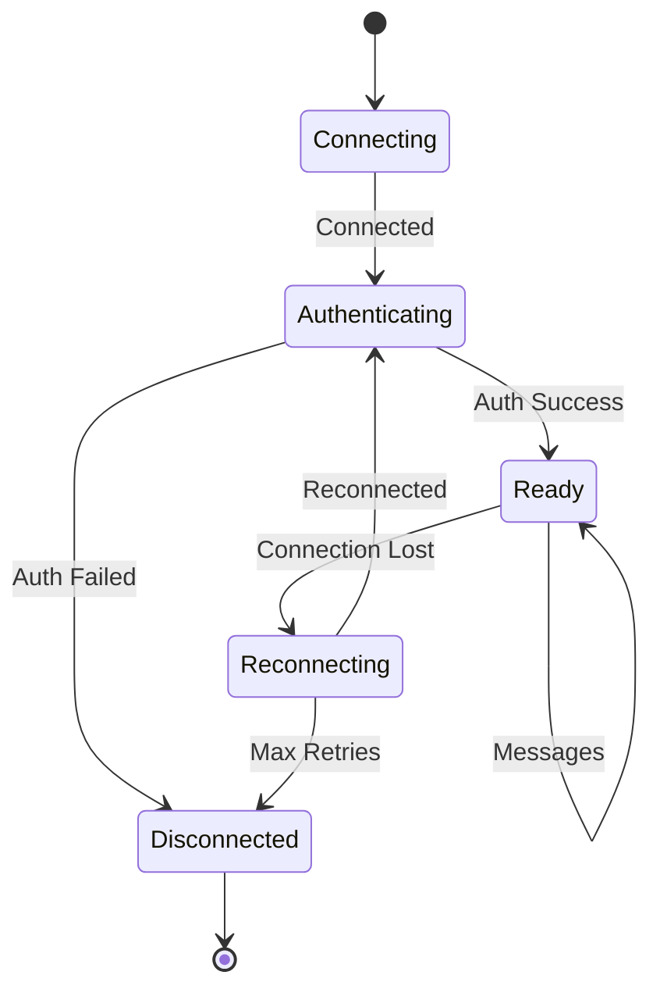

# Skybit WebSocket API Protocol

## Connection

### Endpoint
```
wss://api.skybit.ai/artifact/v1
```

### Connection Flow
1. Establish WebSocket connection
2. Send Auth message with session token
3. Receive Auth confirmation or Error
4. Begin sending Chat messages and receiving responses
5. Maintain connection with Heartbeat messages

### Connection Parameters
- **Protocol**: WebSocket (RFC 6455)
- **Subprotocol**: None
- **Compression**: Per-message deflate supported
- **Ping/Pong**: Every 30 seconds
- **Timeout**: 60 seconds without heartbeat

## Message Envelope

All messages follow this structure:

```typescript
interface Envelope {
  type: MessageType;     // Message type identifier
  id: string;            // UUID v4
  ts: string;            // RFC3339 timestamp
  session: string;       // Session UUID
  data: object;          // Type-specific payload
}

type MessageType = 
  | "Auth"
  | "Chat" 
  | "Plan"
  | "Preview"
  | "Approve"
  | "Cancel"
  | "Status"
  | "Heartbeat"
  | "Error";
```

## Message Types

### Auth (Client → Server)

Authenticate the WebSocket connection.

```json
{
  "type": "Auth",
  "id": "550e8400-e29b-41d4-a716-446655440000",
  "ts": "2024-01-15T10:30:00Z",
  "session": "new",
  "data": {
    "token": "eyJhbGciOiJIUzI1NiIs...",
    "version": "1.0.0",
    "platform": "darwin"
  }
}
```

**Response**: Auth confirmation or Error

```json
{
  "type": "Auth",
  "id": "550e8400-e29b-41d4-a716-446655440001",
  "ts": "2024-01-15T10:30:01Z",
  "session": "7f3b9c2d-4e5f-6g7h-8i9j-0k1l2m3n4o5p",
  "data": {
    "status": "authenticated",
    "user": {
      "id": "user-123",
      "email": "trader@example.com"
    },
    "features": ["equities", "options", "realtime_data"],
    "limits": {
      "max_orders_per_day": 100,
      "max_position_value": 100000
    }
  }
}
```

### Chat (Client → Server)

Send a natural language trading command.

```json
{
  "type": "Chat",
  "id": "550e8400-e29b-41d4-a716-446655440002",
  "ts": "2024-01-15T10:31:00Z",
  "session": "7f3b9c2d-4e5f-6g7h-8i9j-0k1l2m3n4o5p",
  "data": {
    "text": "Buy 200 shares of AAPL at limit 225.10, good for the day",
    "context": {
      "positions": true,
      "recent_orders": true
    }
  }
}
```

### Plan (Server → Client)

Execution plan showing the MCP tools to be called.

```json
{
  "type": "Plan",
  "id": "550e8400-e29b-41d4-a716-446655440003",
  "ts": "2024-01-15T10:31:01Z",
  "session": "7f3b9c2d-4e5f-6g7h-8i9j-0k1l2m3n4o5p",
  "data": {
    "intent": "Place limit buy order for AAPL",
    "tools": [
      {
        "name": "data.snapshot",
        "args": {
          "symbol": "AAPL",
          "fields": ["quote", "daily_stats"]
        },
        "purpose": "Get current market data"
      },
      {
        "name": "risk.check",
        "args": {
          "symbol": "AAPL",
          "quantity": 200,
          "side": "buy",
          "price": 225.10
        },
        "purpose": "Validate against risk limits"
      },
      {
        "name": "trade.preview",
        "args": {
          "symbol": "AAPL",
          "quantity": 200,
          "side": "buy",
          "order_type": "limit",
          "limit_price": 225.10,
          "time_in_force": "day"
        },
        "purpose": "Generate order preview"
      }
    ]
  }
}
```

### Preview (Server → Client)

Detailed order preview for user approval.

```json
{
  "type": "Preview",
  "id": "550e8400-e29b-41d4-a716-446655440004",
  "ts": "2024-01-15T10:31:02Z",
  "session": "7f3b9c2d-4e5f-6g7h-8i9j-0k1l2m3n4o5p",
  "data": {
    "preview_id": "prev-123456",
    "headline": "Buy 200 AAPL @ $225.10 (DAY)",
    "orders": [
      {
        "symbol": "AAPL",
        "side": "buy",
        "quantity": 200,
        "order_type": "limit",
        "limit_price": 225.10,
        "time_in_force": "day",
        "estimated_total": 45020.00
      }
    ],
    "impact": {
      "avg_price": 225.10,
      "total_value": 45020.00,
      "commission": 1.00,
      "fees": [
        {
          "type": "SEC",
          "amount": 0.46
        },
        {
          "type": "TAF",
          "amount": 0.01
        }
      ],
      "total_cost": 45021.47,
      "slippage_bps": 0,
      "pnl_impact": 0
    },
    "policy": {
      "passed": true,
      "checks": [
        {
          "name": "position_limit",
          "status": "pass",
          "message": "Within position limits"
        },
        {
          "name": "daily_trade_limit",
          "status": "pass",
          "message": "23 of 100 daily trades used"
        },
        {
          "name": "buying_power",
          "status": "pass",
          "message": "Sufficient buying power"
        }
      ]
    },
    "quote": {
      "ts": "2024-01-15T10:31:02Z",
      "source": "nbbo:polygon",
      "bid": 225.05,
      "ask": 225.15,
      "last": 225.08,
      "volume": 42358291
    },
    "expires_at": "2024-01-15T10:32:02Z"
  }
}
```

### Approve (Client → Server)

Approve a preview for execution.

```json
{
  "type": "Approve",
  "id": "550e8400-e29b-41d4-a716-446655440005",
  "ts": "2024-01-15T10:31:30Z",
  "session": "7f3b9c2d-4e5f-6g7h-8i9j-0k1l2m3n4o5p",
  "data": {
    "preview_id": "prev-123456",
    "modifications": null
  }
}
```

With modifications:

```json
{
  "type": "Approve",
  "id": "550e8400-e29b-41d4-a716-446655440005",
  "ts": "2024-01-15T10:31:30Z",
  "session": "7f3b9c2d-4e5f-6g7h-8i9j-0k1l2m3n4o5p",
  "data": {
    "preview_id": "prev-123456",
    "modifications": {
      "quantity": 150,
      "limit_price": 225.00
    }
  }
}
```

### Cancel (Client → Server)

Cancel a preview or active order.

```json
{
  "type": "Cancel",
  "id": "550e8400-e29b-41d4-a716-446655440006",
  "ts": "2024-01-15T10:31:35Z",
  "session": "7f3b9c2d-4e5f-6g7h-8i9j-0k1l2m3n4o5p",
  "data": {
    "target": "preview",
    "preview_id": "prev-123456"
  }
}
```

Cancel order:

```json
{
  "type": "Cancel",
  "id": "550e8400-e29b-41d4-a716-446655440007",
  "ts": "2024-01-15T10:32:00Z",
  "session": "7f3b9c2d-4e5f-6g7h-8i9j-0k1l2m3n4o5p",
  "data": {
    "target": "order",
    "order_id": "ord-789012"
  }
}
```

Cancel all orders:

```json
{
  "type": "Cancel",
  "id": "550e8400-e29b-41d4-a716-446655440008",
  "ts": "2024-01-15T10:32:00Z",
  "session": "7f3b9c2d-4e5f-6g7h-8i9j-0k1l2m3n4o5p",
  "data": {
    "target": "all_orders"
  }
}
```

### Status (Server → Client)

Order status updates.

```json
{
  "type": "Status",
  "id": "550e8400-e29b-41d4-a716-446655440009",
  "ts": "2024-01-15T10:31:31Z",
  "session": "7f3b9c2d-4e5f-6g7h-8i9j-0k1l2m3n4o5p",
  "data": {
    "order_id": "ord-789012",
    "client_order_id": "cli-123456",
    "status": "acknowledged",
    "symbol": "AAPL",
    "side": "buy",
    "quantity": 200,
    "filled": 0,
    "remaining": 200,
    "avg_fill_price": null,
    "timestamps": {
      "created": "2024-01-15T10:31:30Z",
      "acknowledged": "2024-01-15T10:31:31Z"
    }
  }
}
```

Status progression:

```json
{
  "type": "Status",
  "id": "550e8400-e29b-41d4-a716-446655440010",
  "ts": "2024-01-15T10:31:45Z",
  "session": "7f3b9c2d-4e5f-6g7h-8i9j-0k1l2m3n4o5p",
  "data": {
    "order_id": "ord-789012",
    "client_order_id": "cli-123456",
    "status": "partial_fill",
    "symbol": "AAPL",
    "side": "buy",
    "quantity": 200,
    "filled": 100,
    "remaining": 100,
    "avg_fill_price": 225.09,
    "last_fill": {
      "quantity": 100,
      "price": 225.09,
      "timestamp": "2024-01-15T10:31:45Z"
    }
  }
}
```

Final status:

```json
{
  "type": "Status",
  "id": "550e8400-e29b-41d4-a716-446655440011",
  "ts": "2024-01-15T10:32:00Z",
  "session": "7f3b9c2d-4e5f-6g7h-8i9j-0k1l2m3n4o5p",
  "data": {
    "order_id": "ord-789012",
    "client_order_id": "cli-123456",
    "status": "filled",
    "symbol": "AAPL",
    "side": "buy",
    "quantity": 200,
    "filled": 200,
    "remaining": 0,
    "avg_fill_price": 225.095,
    "total_commission": 1.00,
    "total_fees": 0.47,
    "net_amount": 45020.47
  }
}
```

### Heartbeat (Bidirectional)

Keep connection alive and measure latency.

Client → Server:
```json
{
  "type": "Heartbeat",
  "id": "550e8400-e29b-41d4-a716-446655440012",
  "ts": "2024-01-15T10:30:30Z",
  "session": "7f3b9c2d-4e5f-6g7h-8i9j-0k1l2m3n4o5p",
  "data": {
    "client_ts": "2024-01-15T10:30:30.123Z"
  }
}
```

Server → Client:
```json
{
  "type": "Heartbeat",
  "id": "550e8400-e29b-41d4-a716-446655440013",
  "ts": "2024-01-15T10:30:30Z",
  "session": "7f3b9c2d-4e5f-6g7h-8i9j-0k1l2m3n4o5p",
  "data": {
    "client_ts": "2024-01-15T10:30:30.123Z",
    "server_ts": "2024-01-15T10:30:30.145Z",
    "latency_ms": 22
  }
}
```

### Error (Server → Client)

Error notifications.

```json
{
  "type": "Error",
  "id": "550e8400-e29b-41d4-a716-446655440014",
  "ts": "2024-01-15T10:33:00Z",
  "session": "7f3b9c2d-4e5f-6g7h-8i9j-0k1l2m3n4o5p",
  "data": {
    "code": "INSUFFICIENT_FUNDS",
    "message": "Insufficient buying power for this order",
    "details": {
      "required": 45020.00,
      "available": 10000.00
    },
    "request_id": "550e8400-e29b-41d4-a716-446655440005",
    "recoverable": true,
    "suggestions": [
      "Reduce order quantity",
      "Deposit additional funds",
      "Close existing positions"
    ]
  }
}
```

## Error Codes

| Code | Description | Recoverable |
|------|-------------|-------------|
| AUTH_FAILED | Authentication failed | No |
| SESSION_EXPIRED | Session token expired | Yes |
| INVALID_REQUEST | Malformed request | Yes |
| INSUFFICIENT_FUNDS | Not enough buying power | Yes |
| POSITION_LIMIT | Position limit exceeded | Yes |
| RATE_LIMIT | Too many requests | Yes |
| MARKET_CLOSED | Market is closed | Yes |
| SYMBOL_NOT_FOUND | Invalid symbol | Yes |
| ORDER_REJECTED | Order rejected by broker | Maybe |
| CONNECTION_ERROR | Network issue | Yes |
| INTERNAL_ERROR | Server error | Maybe |

## Idempotency

To ensure orders are not duplicated:

1. Client generates unique `client_order_id` for each order
2. Include `X-Idem-Key` header in Approve messages
3. Server deduplicates requests for 24 hours
4. Response includes original `client_order_id`

Example:
```json
{
  "type": "Approve",
  "id": "550e8400-e29b-41d4-a716-446655440015",
  "ts": "2024-01-15T10:35:00Z",
  "session": "7f3b9c2d-4e5f-6g7h-8i9j-0k1l2m3n4o5p",
  "data": {
    "preview_id": "prev-123456",
    "client_order_id": "cli-unique-123",
    "idem_key": "idem-550e8400"
  }
}
```

## Rate Limits

| Operation | Limit | Window |
|-----------|-------|--------|
| Chat messages | 60 | 1 minute |
| Approvals | 100 | 1 minute |
| Heartbeats | 120 | 1 minute |
| Total messages | 500 | 1 minute |
| Connections | 10 | Per user |

## Subscription Management

Subscribe to real-time data:

```json
{
  "type": "Subscribe",
  "id": "550e8400-e29b-41d4-a716-446655440016",
  "ts": "2024-01-15T10:36:00Z",
  "session": "7f3b9c2d-4e5f-6g7h-8i9j-0k1l2m3n4o5p",
  "data": {
    "channels": [
      {
        "type": "quotes",
        "symbols": ["AAPL", "GOOGL", "MSFT"]
      },
      {
        "type": "orders",
        "all": true
      },
      {
        "type": "positions",
        "all": true
      }
    ]
  }
}
```

Unsubscribe:

```json
{
  "type": "Unsubscribe",
  "id": "550e8400-e29b-41d4-a716-446655440017",
  "ts": "2024-01-15T10:37:00Z",
  "session": "7f3b9c2d-4e5f-6g7h-8i9j-0k1l2m3n4o5p",
  "data": {
    "channels": ["quotes"]
  }
}
```

## Market Data Updates

Real-time quote updates (after subscription):

```json
{
  "type": "MarketData",
  "id": "550e8400-e29b-41d4-a716-446655440018",
  "ts": "2024-01-15T10:36:01Z",
  "session": "7f3b9c2d-4e5f-6g7h-8i9j-0k1l2m3n4o5p",
  "data": {
    "type": "quote",
    "symbol": "AAPL",
    "bid": 225.06,
    "bid_size": 300,
    "ask": 225.14,
    "ask_size": 500,
    "last": 225.10,
    "volume": 42358500,
    "timestamp": "2024-01-15T10:36:01.234Z",
    "source": "polygon"
  }
}
```

## Connection States



## Best Practices

1. **Always handle reconnection** - Implement exponential backoff
2. **Use heartbeats** - Detect stale connections early
3. **Implement message queuing** - Buffer messages during reconnection
4. **Validate before sending** - Check message structure client-side
5. **Handle all error codes** - Provide appropriate user feedback
6. **Use idempotency keys** - Prevent duplicate orders
7. **Subscribe selectively** - Only subscribe to needed data
8. **Respect rate limits** - Implement client-side throttling
9. **Log important events** - Aid debugging and support
10. **Version your client** - Include version in Auth message